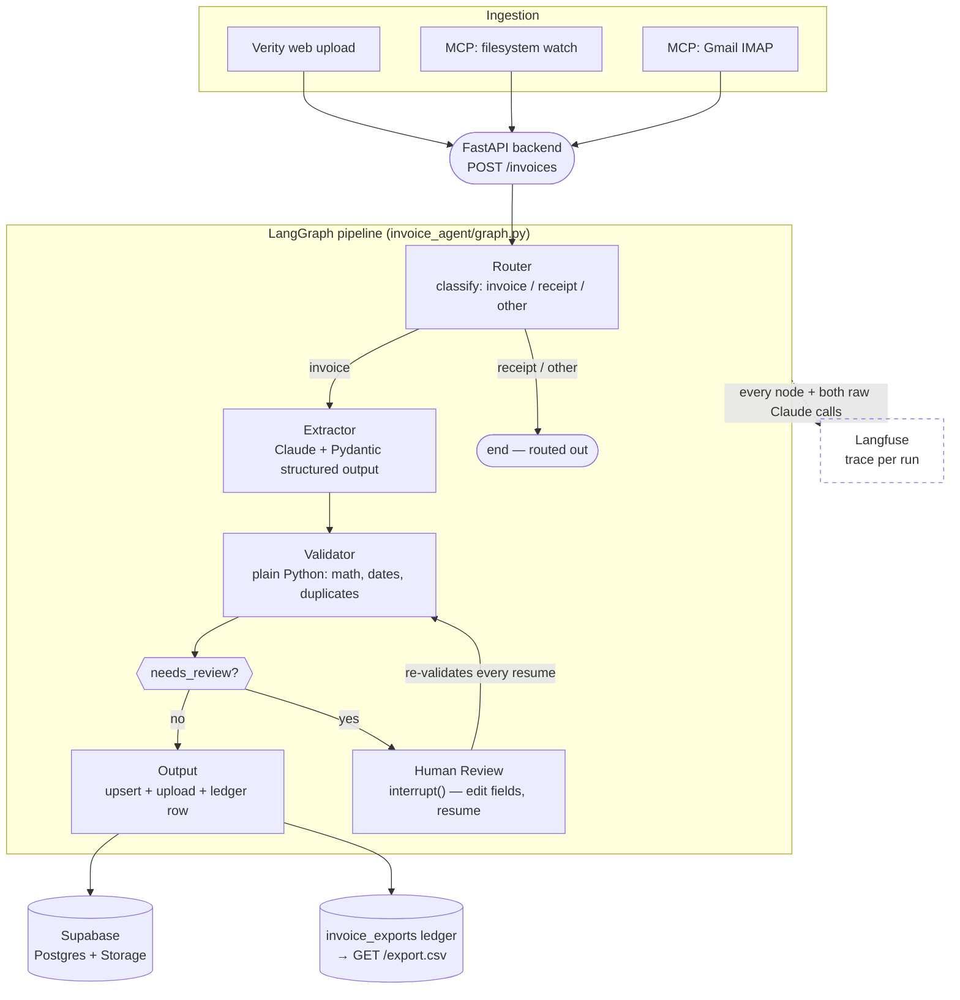

# Multi-Agent Invoice Processor

**Turns a PDF invoice into a validated, database-ready record — with a human in the loop for anything that doesn't add up.**

A recruiter or client hands this system an invoice (or it pulls one from an inbox automatically). A small pipeline of specialized agents classifies it, extracts every field with a structured-output LLM call, runs deterministic business-rule checks (not another LLM call — plain arithmetic and date math), flags anything wrong for a human to fix, and writes the clean result to Postgres. Every run is traced end-to-end, the extraction accuracy is measured against a labeled eval set rather than asserted, and the whole thing ships as Docker images (backend and frontend) with a live URL.

<!-- The link below is the old Streamlit deployment. Update it (or remove it)
     once the Railway services are migrated - see deploy/railway.md,
     "Migrating an existing Streamlit deployment". -->
**[Live demo →](https://frontend-production-d7a5.up.railway.app)**

<p align="center">
  <!-- Add a screenshot/GIF here: docs/images/verity-live-run.png -->
  <em>Screenshot / demo GIF placeholder — see docs/demo_script.md for the shot list</em>
</p>

## Why this exists

Most "AI invoice extraction" demos stop at "the LLM read the PDF." That's the easy 80%. The parts that actually matter for a system someone would trust with real money are the other 20%: *is the extracted total mathematically consistent, is this a duplicate, what happens when the model gets something wrong, and can someone verify any of this after the fact.* This project is built around those questions, not around the extraction call.

## How it works



Every run is a LangGraph `thread_id` checkpointed to SQLite, so a flagged invoice can sit "awaiting review" indefinitely and resume exactly where it left off — including across a backend restart, since state lives in SQLite, not memory.

## Feature list

- **PDF-native extraction** — Claude reads the PDF directly (as a `document` content block) with a Pydantic `output_format`; no separate OCR step for the common case, digital or scanned.
- **Deterministic validation, not vibes** — line items must sum to the stated subtotal, subtotal + tax must equal total (±$0.01), dates must be valid ISO 8601 with `due_date >= invoice_date`, and vendor+invoice-number pairs are checked against Supabase for duplicates. None of this is delegated to the LLM.
- **Human-in-the-loop review** — any flagged invoice interrupts the graph (`interrupt()`) with the extracted data and the exact flags that tripped; a human corrects the offending fields in Verity's review screen and resumes. The resume path re-runs the *same* validator, not a rubber stamp — a partial fix that leaves one flag standing re-interrupts instead of silently passing through.
- **Automated ingestion** — an MCP server pulls new invoices from a filesystem inbox or a Gmail account (IMAP + App Password) and runs each one through the same pipeline unattended.
- **Full observability** — every graph run is traced in Langfuse: the LangGraph node tree is auto-captured, and the two raw Claude calls (router, extractor) are recorded as generation spans with cost/latency, since they bypass `langchain_anthropic`'s own tracing hook.
- **Quantified accuracy, not a claim** — a 20-document eval harness scores field-level exact-match, micro/macro-F1, and a document-level "every field and every line item correct" metric, sliced by currency and render type (digital vs. scanned). See [Eval results](#eval-results) below.
- **Verity, a live web UI** — a Next.js frontend where fields appear one by one as the model extracts them (streamed over Server-Sent Events), the validation checks then resolve green or red in sequence, and a flagged invoice opens straight into an editable review screen. A read-only detail view links each completed invoice to its source PDF and its Langfuse trace, and a persistent export bar shows the shared ledger and downloads it as CSV.
- **REST API** — a FastAPI backend (upload, live event stream, poll, resume, list, CSV export, health/readiness); the frontend is just one client of it.
- **Containerized, CI-built, deployable** — a backend image and a Next.js frontend image (standalone build, backend URLs read at runtime so one image serves any deployment); GitHub Actions tests and publishes both to GHCR on every push; deploy guides cover Railway (primary) and a 1GB-RAM EC2 box (documented for AWS range).

## Tech stack

| Layer | Choice | Why |
|---|---|---|
| Orchestration | LangGraph (LangChain 1.x) | Native `interrupt()`/checkpointing for human-in-the-loop is exactly this problem's shape — a graph that can pause mid-run and resume later, not just a linear chain. |
| Extraction model | Claude (`claude-sonnet-5`) | Structured outputs + native PDF understanding in a single call — no separate OCR/vision pipeline for the common case. |
| Data contracts | Pydantic v2 | Every inter-agent handoff is a typed model, not a dict with hopeful key names — the schema *is* the LLM's structured-output contract too. |
| Business rules | Plain Python | Math and date logic should be deterministic and testable, not another place the LLM can hallucinate. |
| Database + storage | Supabase (Postgres + Storage) | Managed Postgres with an object store for the source PDFs, one project, one set of credentials. |
| Ingestion | MCP (`langchain-mcp-adapters`) | Standardized tool-calling interface for "list/download/mark-processed" — swapping Gmail for another source is a new MCP server, not a rewrite. |
| Checkpointing | `SqliteSaver` | State survives an HTTP backend restart — `InMemorySaver` doesn't, and this system explicitly needs runs to outlive a single request. |
| Observability | Langfuse | Full trace per run, including the two raw Anthropic SDK calls that would otherwise be invisible to LangChain's own instrumentation. |
| Backend / frontend | FastAPI + Next.js (Verity) | A typed REST API for real integration, plus a UI a non-technical reviewer can actually use — streaming extraction and validation live over SSE, which is what makes the pipeline's work visible instead of a spinner. |
| Deploy | Docker → Railway (primary) / EC2 (documented) | Two images built once in CI and pulled, never built on the target; Railway for the live link, EC2 documented to show the constrained-resource, "you build the box" side of deployment too. |

## Production signals

Things a from-scratch script usually doesn't have, that this does:

- **250+ automated tests**, all offline (mocked at the HTTP/API boundary — no live credentials needed to run `pytest`), covering the graph, validation, the API layer and its event stream, the export ledger, and the MCP ingestion sources.
- **A quantified eval harness** (`evals/`) with per-field precision/recall/F1, not just "it worked on the examples I tried."
- **Human-in-the-loop that actually re-validates.** A common shortcut is "human edited it, so trust it" — this system re-runs the full validator (math, dates, duplicate check) on every resume, so a partial or wrong correction is caught, not silently persisted.
- **Structured error handling on the API**, not bare 500s — a typed `ApiError` hierarchy distinguishes "the model is degraded," "the PDF is unprocessable," "persistence failed," etc., each mapped to the right HTTP status and a message safe to show a client, with the real exception still logged server-side.
- **Two health endpoints with different contracts** — `/health` does zero I/O (safe for a container `HEALTHCHECK` to hit every 30s without ever restarting a healthy container over a transient upstream blip); `/health/ready` actually checks config and, optionally, live service connectivity.
- **CI that tests before it ships** — GitHub Actions runs the full suite before building/pushing the Docker image; a failing test blocks the image from ever reaching GHCR.
- **Non-root containers, single-worker on constrained RAM, real deploy docs** — not "works on my machine," a documented path to a 1GB-RAM production box with the actual OOM pitfalls called out.

## Eval results

Full report: [`evals/report.md`](evals/report.md) · Run yourself: `python evals/run_eval.py`

| Metric | Score |
|---|---|
| Field-level exact-match accuracy | **100.0%** |
| Document-level exact match (every field + every line item) | **100.0%** |
| Micro-F1 / Macro-F1 | **1.000 / 1.000** |
| Consistency-check pass rate (subtotal + tax = total) | **100.0%** |
| Dataset | 20 synthetic invoices — 17 digital, 3 scanned; USD/EUR/GBP/JPY |

**Read this number correctly:** the eval set is synthetic (`scripts/generate_eval_set.py`), not hand-labeled real-world invoices — gold labels are exact by construction, which removes transcription error from the ground truth, but real-world layout diversity (handwriting, unusual templates, poor scans) is wider than one renderer can cover. Treat 100% as an upper bound on a controlled distribution, not a claim about arbitrary real invoices — that's exactly why the validator and human-review path exist downstream of extraction, instead of trusting the model output directly.

## Setup

**Prerequisites:** Python 3.12+, [`uv`](https://docs.astral.sh/uv/), an [Anthropic API key](https://console.anthropic.com/), a [Supabase](https://supabase.com/dashboard) project.

```bash
git clone https://github.com/HumdaanSyed/Multi-Agent-Invoice-Processor.git
cd Multi-Agent-Invoice-Processor
uv sync --locked
cp .env.example .env        # fill in ANTHROPIC_API_KEY, SUPABASE_URL, SUPABASE_KEY
python scripts/smoke_test.py   # verifies both service connections before anything else
```

Run the pipeline against one PDF:

```bash
python scripts/run_graph.py data/eval/eval_01_acme_cloud_hosting_llc.pdf
```

Or run the full stack (backend + frontend) locally — the frontend needs Node 20+:

```bash
uvicorn app.main:app --reload &
cd web && npm install && npm run dev
# backend: http://localhost:8000 · frontend (Verity): http://localhost:3000
```

Or run it containerized, no local Python or Node setup at all:

```bash
docker compose up
# backend: http://localhost:8000 · frontend (Verity): http://localhost:3000
```

Run the tests (no credentials needed — everything's mocked at the connection seam):

```bash
uv run pytest
```

**Deeper docs:** [`docs/api.md`](docs/api.md) (REST API reference) · [`web/README.md`](web/README.md) (Verity frontend) · [`docs/mcp_setup.md`](docs/mcp_setup.md) (Gmail/filesystem ingestion) · [`docs/observability.md`](docs/observability.md) (Langfuse tracing) · [`deploy/railway.md`](deploy/railway.md) / [`deploy/ec2.md`](deploy/ec2.md) (deployment)

## Limitations & future work


- **No authentication or rate limiting - and that has a cost.** Both the API and the Verity UI are open to anyone with the URL, and on a public deployment the browser calls the backend directly (CORS only restricts browsers, not scripts). Anyone can `POST /invoices` in a loop and spend your `ANTHROPIC_API_KEY` credits (only a 20MB upload cap and a 2-run concurrency limit throttle it), and can read every run and download the whole ledger via `GET /invoices` and `GET /export.csv`. If you deploy this, set a spend limit and turn off auto-reload in the Anthropic console and keep real invoices out of it - see [`deploy/railway.md`](deploy/railway.md#security-the-backend-is-public). A real deployment needs auth, rate limiting, and per-user data isolation before it touches anyone else's documents.
- **No built-in sample picker.** The old Streamlit UI had a "try a sample" dropdown backed by the 20 PDFs in `data/eval/`; Verity is upload-only, and the images don't ship those files. Use a repo checkout's copy to try it.
- **Single-model extraction.** Everything currently runs on `claude-sonnet-5`; routing simple invoices to a cheaper/faster model and hard scanned documents to a stronger one (mentioned as a design goal) isn't wired up yet — there's no signal in production to route on until this runs against a larger, messier real-world sample.
- **Gmail ingestion is local-only.** MCP's `stdio` transport can't run inside the deployed backend — pulling from Gmail today means running `python -m invoice_agent.ingest_mcp --source gmail` from a machine you control (a cron job, not automatic). An HTTP-transport MCP server would close this gap.
- **No retries/idempotency around the two live API calls** (router, extractor) beyond what the Anthropic SDK does internally — a transient failure mid-run surfaces as a failed run, not an automatic retry.
- **Eval set is synthetic, single-renderer.** See the caveat under [Eval results](#eval-results) — this measures whether the pipeline is internally consistent, not real-world extraction accuracy across arbitrary invoice layouts.
- **The live event stream is single-worker only.** Field and check events flow from the graph to the browser through an in-memory event bus (`invoice_agent/events.py`) - fine for the one Uvicorn worker this project deploys (already forced by the 1GB RAM budget), but a second worker process would have its own independent bus, and a subscriber connected to one would never see events published in the other. Horizontal scaling means moving the bus to Redis pub/sub, not adding locks. The polling fallback in the frontend still reaches a correct final state, but the live view would not work.
- **The export ledger is append-only by design.** Every successful write adds a row to `invoice_exports` and nothing ever updates or deletes one (a database trigger enforces it) - so a corrected re-run of the same invoice appears twice in `GET /export.csv`, once per write, as an audit trail rather than a deduplicated snapshot. The `invoices` table is the deduplicated system of record; the ledger is what actually happened, in order.
- **No PII handling.** Real invoices contain names, addresses, sometimes bank details — nothing here redacts, encrypts at rest beyond Supabase's defaults, or enforces retention limits.

---
