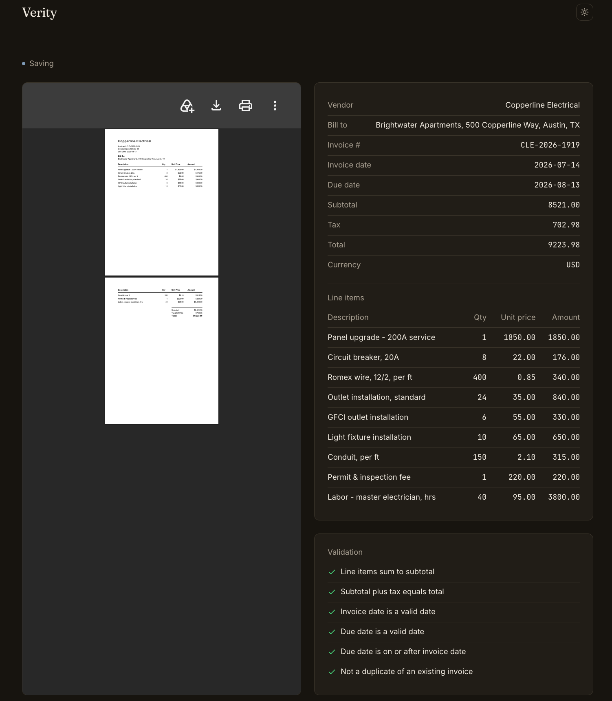
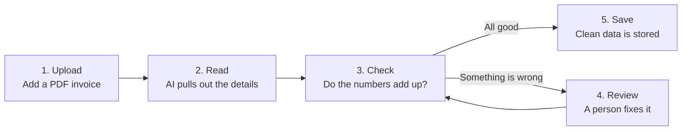

# Verity

Turns invoice PDFs into clean, checked data you can trust.

**[Live demo](https://frontend-production-d7a5.up.railway.app)**



## What it does

A business receives invoices as PDF files. Verity reads each one and pulls out the details, such as who sent it, the dates, the line items, and the total. It then checks that the numbers add up. If anything looks wrong, it asks a person to fix it before saving, and the clean data can be exported as a spreadsheet (a CSV file).

## Why it's useful

- Saves the time spent typing invoice details in by hand.
- Catches math mistakes, invalid dates, and duplicate invoices before they are saved.
- Keeps a person in control: anything uncertain goes to a human, and their fix is checked again.
- Exports everything to a CSV file that opens in Excel or Google Sheets.

## How it works

You can watch each invoice being read live on screen, then see every check turn green or red.



## Built with

- **Claude**: the AI that reads the invoices.
- **LangGraph**: connects the steps and pauses for a human review.
- **Next.js**: the website you use.
- **FastAPI**: the server behind the website.
- **Supabase**: the database that stores invoices and their PDFs.
- **Langfuse**: records every run so problems are easy to trace.
- **Docker**: packages the app so it runs the same way anywhere.
- **Railway**: hosts the live demo.

## Run it yourself

You need Python 3.12 or newer, [uv](https://docs.astral.sh/uv/) (a Python tool that installs dependencies), Docker, an [Anthropic API key](https://console.anthropic.com/) (the account that powers Claude), and a free [Supabase](https://supabase.com/) project.

Download the code and install what it needs:

```bash
git clone https://github.com/HumdaanSyed/Multi-Agent-Invoice-Processor.git
cd Multi-Agent-Invoice-Processor
uv sync --locked
```

Create your settings file, then open `.env` and add your Anthropic and Supabase keys:

```bash
cp .env.example .env
```

In Supabase, run the SQL in `db/schema.sql` and create a private storage bucket named `invoice-pdfs`. Then check that your keys work:

```bash
uv run python scripts/smoke_test.py
```

Start the whole app, then open http://localhost:3000 in your browser:

```bash
docker compose up
```

## Limitations

- There is no login, so anyone with the link can use it and spend your Claude credits. Do not deploy it with real invoices.
- Importing invoices from Gmail only runs from your own computer, not from the deployed site.
